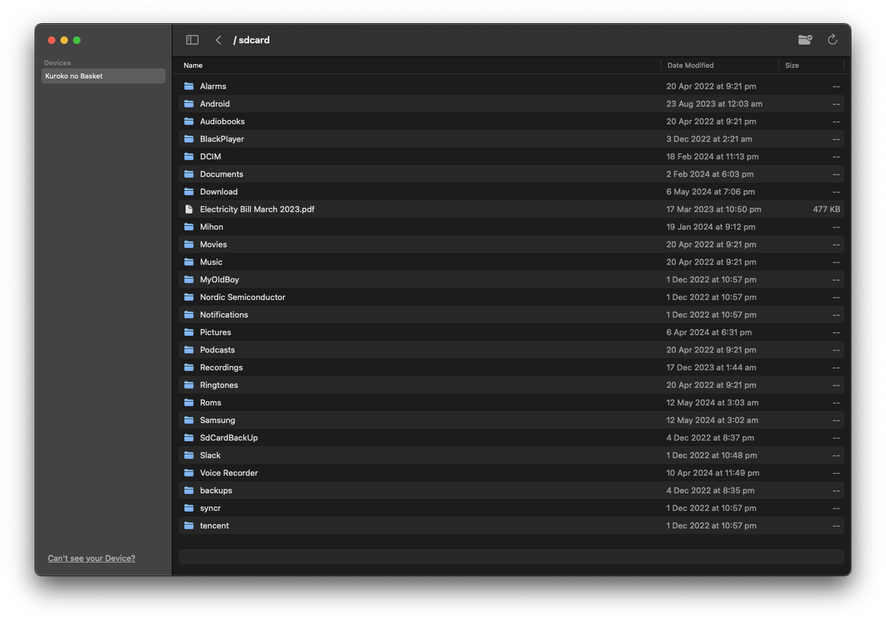
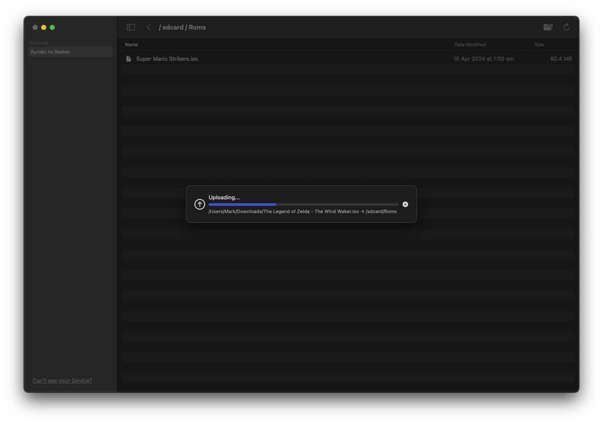
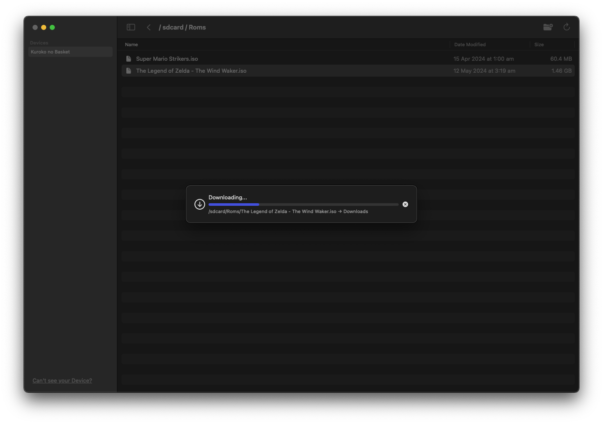

  

# Android Buddy

A simple Mac application that lets you transfer files to and from your Android device.

[Download the latest release here](https://github.com/MarkBorazio/AndroidBuddy/releases)
(Requires MacOS 13.5 or later)

# Introduction

I created this because I hate Google's Android File Transfer app. Other alternatives exist, but I wanted one that looks like a standard MacOS app.

# Features
- Transfer files larger than 4GB
- Delete, move, and rename files and folders
- Create new folders
- Instantaneous device detection when plugging in via USB
- Drag and Drop files
- Supports multiple devices simultaneously
- Standard MacOS theming (including dark mode support)
- **Does not** automatically open when you plug in an Android device

# Screenshots

  
  
  

# Contribute
PRs and bugfixes are welcome.

In order to set yourself up for development, you will need:
- MacOS 13.5 or higher
- Xcode 15 or higher

Simply clone the repo and open it in Xcode. The only dependency in this app is ADB, which is bundled statically, so Xcode should be able to run things without an issue.

This app is built using the SwiftUI and Combine frameworks.